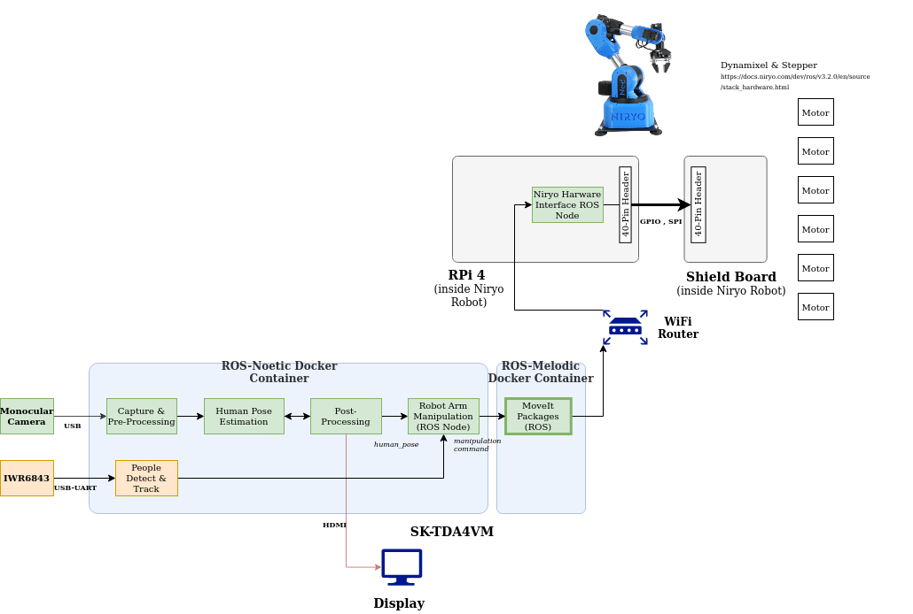

# Robot Arm Following Demo

[](https://www.youtube.com/watch?v=YftINLPC4SE)

## Demo Description

Figure 1 shows the overall flow of the robot arm following demo. This demo demonstrates the following key aspects:

1. Detect people and estimate human poses from the camera input based on a deep learning network.
2. Locate the right hand (wrist) of a main person and convert it to the command to a robot arm so that the robot arm follows the main person's right hand (wrist).
3. Robot arm's path planning is done by Moveit running on the TDA4VM SK board and the robot arm's motor control is done by RPi 4 in the robot arm.
4. Detect and track people using a radar sensor, and stop the robot arm for safety when people is too close to it.



<figcaption>Figure 1. Robot arm following demo</figcaption>
<br />

## Running Robot Arm Following Demo

### Niryo Robot

1. Once the Niryo robot is up, calibrate it first.
2. Log on to the Niryo robot, kill the ROS master.

```
niryo@ned2 ~ $ killall -9 rosmaster
```

3. Set `ROS_IP` and `ROS_MASTER_URI`, which are the same as the Niryo IP address.

```
niryo@ned2 ~ $ cd catkin_ws
niryo@ned2 ~/catkin_ws $ export ned2_ip_address=w.x.y.z
niryo@ned2 ~/catkin_ws $ export ROS_IP=$ned2_ip_address
niryo@ned2 ~/catkin_ws $ export ROS_MASTER_URI=http://$ned2_ip_address:11311
```

4. Launch Niryo robot.

```
niryo@ned2 ~/catkin_ws $ source devel/setup.bash
niryo@ned2 ~/catkin_ws $ roslaunch niryo_robot_bringup niryo_ned2_robot.launch
```

### SK Board

1. Run ROS Melodic docker container and build the ROS workspace.

```
root@tda4vm-sk:/opt/robot/niryo-tda4vm# cd nodes/ned_ros
root@tda4vm-sk:/opt/robot/niryo-tda4vm/nodes/ned_ros# .docker/run_docker.sh /bin/bash
root@tda4vm-sk:~/catkin_ws# catkin_make --source src
```

2. Set `ROS_IP`, which is the SK board IP and `ROS_MASTER_URI`, which is the Niryo IP.

```
root@tda4vm-sk:~/catkin_ws# export sk_ip_address=a.b.c.d
root@tda4vm-sk:~/catkin_ws# export ned2_ip_address=w.x.y.z
root@tda4vm-sk:~/catkin_ws# export ROS_IP=$sk_ip_address
root@tda4vm-sk:~/catkin_ws# export ROS_MASTER_URI=http://$ned2_ip_address:11311
```

3. Then launch Moveit in the Melodic docker container.

```
root@tda4vm-sk:~/catkin_ws# source devel/setup.bash
root@tda4vm-sk:~/catkin_ws# roslaunch niryo_moveit_config_standalone move_group.launch hardware_version:=ned2
```

* Note that Moveit should be launched on the SK board within a couple of minutes after launcing niryo_ned2_robot.launch on the Niryo robot. Otherwise, the Niryo robot will throw timeout error. In this case, niryo_ned2_robot.launch can be launched again.

4. On another terminal, run ROS Noetic docker container and build the ROS workspace.

```
root@tda4vm-sk:~/j7ros_home# ./docker_run_ros1.sh
root@j7-docker:~/j7ros_home/ros_ws$ catkin_make --source /opt/robot/tda4x-robotarm-demos/nodes/arm_follow_demo
root@j7-docker:~/j7ros_home/ros_ws$ catkin_make --source /opt/robot/tda4x-robotarm-demos/nodes/radar_driver
```

5. Launch the radar node for occupancy grid in the Noetic docker container.

```
root@j7-docker:~/j7ros_home/ros_ws$ export ned2_ip_address=w.x.y.z
root@j7-docker:~/j7ros_home/ros_ws$ export ROS_MASTER_URI=http://$ned2_ip_address:11311
root@j7-docker:~/j7ros_home/ros_ws$ source devel/setup.bash
root@j7-docker:~/j7ros_home/ros_ws$ roslaunch ti_mmwave_rospkg 6843ISK_Occupancy.launch
```

6. On another terminal, launch the human pose estimation node in the Noetic docker container

```
root@tda4vm-sk:~/j7ros_home# ./docker_run_ros1.sh
root@j7-docker:~/j7ros_home/ros_ws$ export ned2_ip_address=w.x.y.z
root@j7-docker:~/j7ros_home/ros_ws$ export ROS_MASTER_URI=http://$ned2_ip_address:11311
root@j7-docker:~/j7ros_home/ros_ws$ source devel/setup.bash
root@j7-docker:~/j7ros_home/ros_ws# cd /opt/edge_ai_apps/apps_python
root@j7-docker:/opt/edge_ai_apps/apps_python$ ./app_edgeai.py ../config/human_pose_estimation.yaml
```

7. Finally, on another terminal, launch the robot arm follow node

```
root@tda4vm-sk:~/j7ros_home# ./docker_run_ros1.sh
root@j7-docker:~/j7ros_home/ros_ws$ export ned2_ip_address=w.x.y.z
root@j7-docker:~/j7ros_home/ros_ws$ export ROS_MASTER_URI=http://$ned2_ip_address:11311
root@j7-docker:~/j7ros_home/ros_ws$ source devel/setup.bash
root@j7-docker:~/j7ros_home/ros_ws# rosrun robot_arm_follow_demo robot_arm_follow.py
```


<!--
# robot_arm_follow_demo package

## Package Dependencies:
1. geometry_msgs
2. roscpp
3. rospy
4. shape_msgs
5. std_msgs

## Messages:

### New Messages:
1. HumanPose.msg
2. Frame.msg

### Message Dependencies:
1. geometry_msgs/Point
2. shape_msgs/SolidPrimitive
3. niryo_robot_arm_commander/ArmMoveCommand
4. niryo_robot_msgs/RPY

## Actions:

### Action Dependencies:
1. RobotMoveAction
-->
